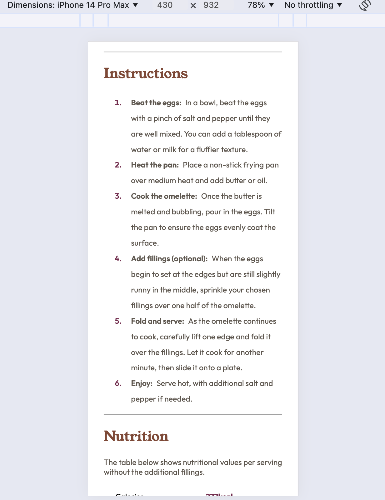
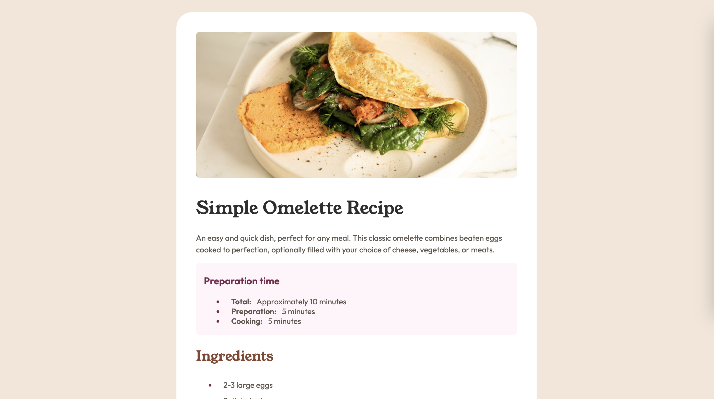

# Frontend Mentor - Recipe page solution

This is a solution to the [Recipe page challenge on Frontend Mentor](https://www.frontendmentor.io/challenges/recipe-page-KiTsR8QQKm). Frontend Mentor challenges help you improve your coding skills by building realistic projects. 

## Table of contents

- [Overview](#overview)
  - [Screenshot](#screenshot)
  - [Links](#links)
  - [Built with](#built-with)
  - [What I learned](#what-i-learned)
  - [Continued development](#continued-development)
  - [Useful resources](#useful-resources)
- [Author](#author)
- [Acknowledgments](#acknowledgments)

**Note: Delete this note and update the table of contents based on what sections you keep.**

## Overview

Single scrollable recipe page.

### Screenshot

### Links

- Solution URL:https://github.com/sdkdeepa/recipe-page
- [Live Site](https://sdkdeepa.github.io/recipe-page)

### Built with

- Semantic HTML5 markup
- CSS custom properties
- Flexbox

### What I learned
This was really a good challenge. I learnt a lot about  styling lists using pseudo elements.

### Continued development
I need to improve creating tables and styling pseudo elements.

### Useful resources
- [W3 Schools](https://www.w3schools.com/html/html_lists.asp).
- [pseudo elements](https://developer.mozilla.org/en-US/docs/Web/CSS/::marker) I had to read this for styling those elipsis and bolded texts on the lists. Once I figured out for preparation, it was easy to for ingredients and instruction section. 
- [Table](https://www.htmltables.io/) easier to create tags for table. I usually mess up with `tr` and `td`. This was useful to some extend to create the table, number of rows and columns.

## Author
**Frontend Mentor - [@sdkdeepa](https://www.frontendmentor.io/profile/sdkdeepa)**
